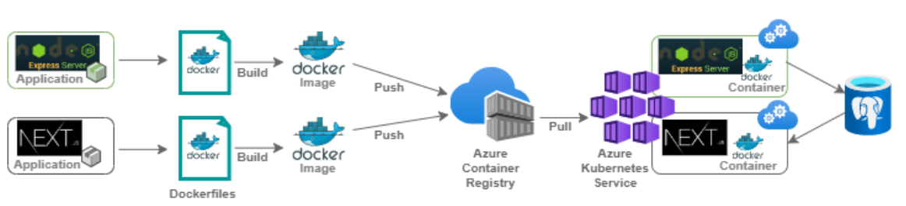

# HW 1

## Part I – Leverage IaaS in a Cloud Application Development Context (Warmup) 

## Part II – Deploy Cloud-Native Application on the Microsoft Azure Cloud
A simple full-stack database catalog application built in microservices. Both back/front-end microservices are containerized using Docker, pushed tp Azure's Container Registry Service (ACR), deployed on Kubernetes cluster managed by Azure Kubernetes Service (AKS).
