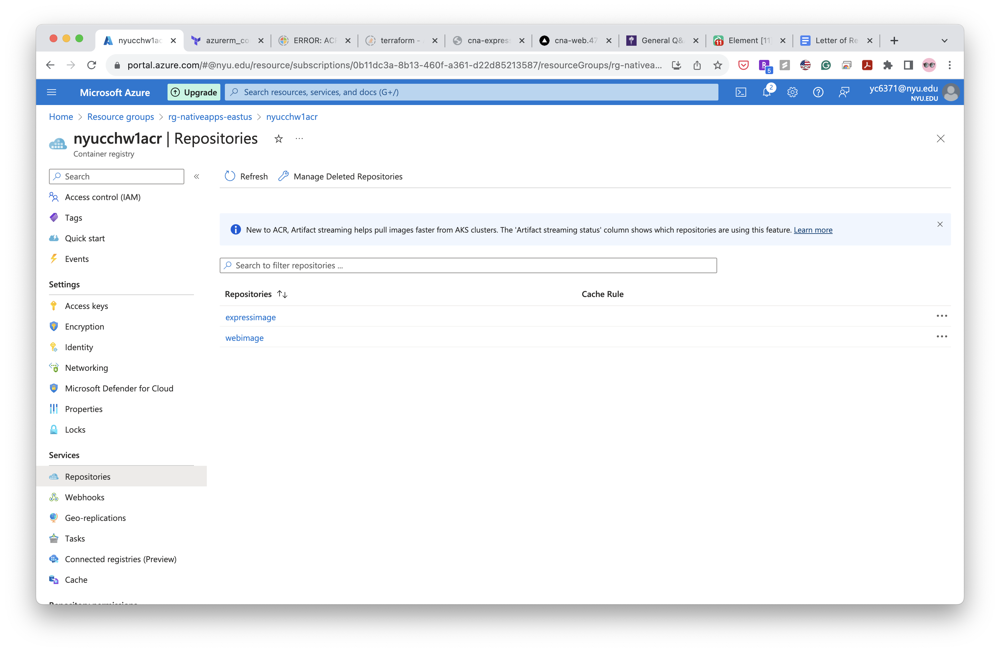
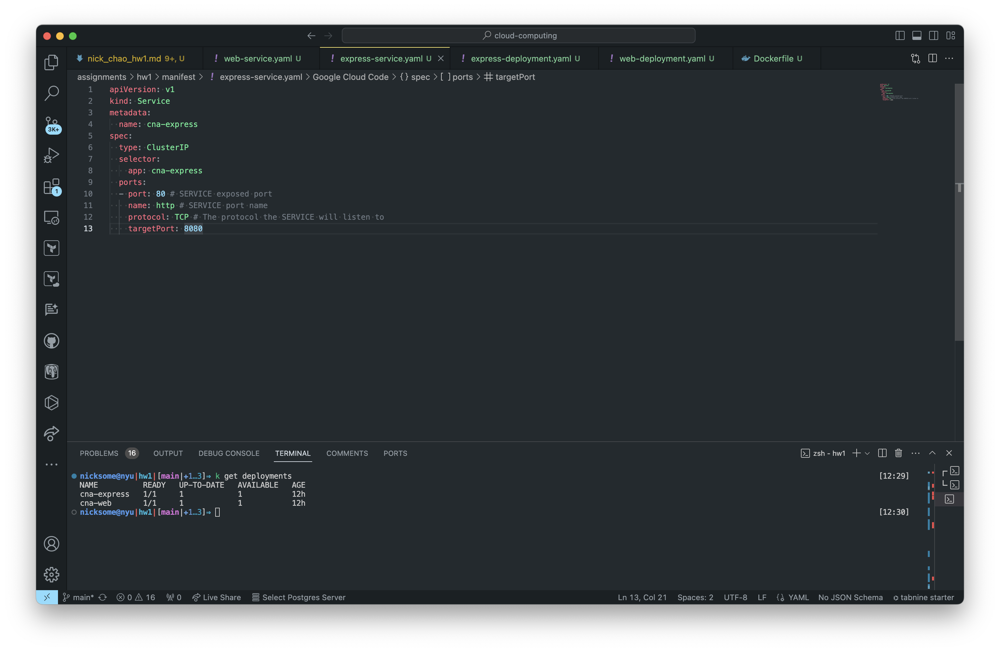

# Part 1

- [x] Create a micro instance with SUSE 64 bit Linux stack with appropriate keys and access control.

- [x] SSH into the instance you created.

# Part 2
## Prerequisites

- [x] create a Azure resource group

## Setup a Postgres Database in Azure

- [x] Setup a Postgres Database in Azure

- [x] Configure Connection Security

- [x] Create the Database, Tables and Initial Data

## Create and Deploy the Cloud-Native Application

- [x] Create the Back-End Service

- [x] Connect the Cloud-Native Application to the Database & Create the Express.js REST API Endpoints

- [x] Create the Front-End Component

## Build and Store Microservices Images in an Azure Container Registry

- [x] Create the Azure Container Registry

## Build the Docker Images

- [x] Containerize the Back-End Service

- [x] Containerize the Front-End Service

- [x] push to ACR

## Create an Azure Kubernetes Service Instance

## Deploy Microservices to the Kubernetes Cluster

- [x] Set Up the Environment

- [x] Create and Apply the Deployment Manifests

- [x] Create and Apply the Service Manifests

- [x] Create and Apply the Ingress Controllers

- [x] Access the Services

