# Part 1 Manage data in the Cloud

## Azure

- [x] Create a storage account
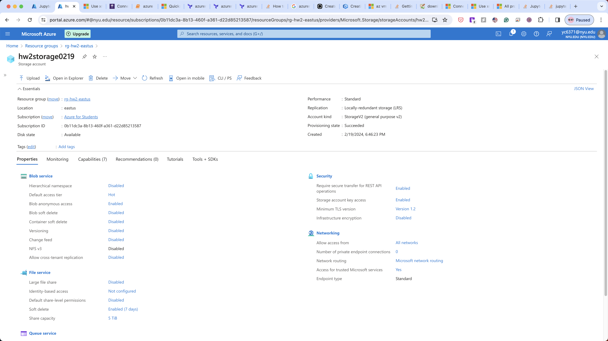
- [x] Copy the secondary access key
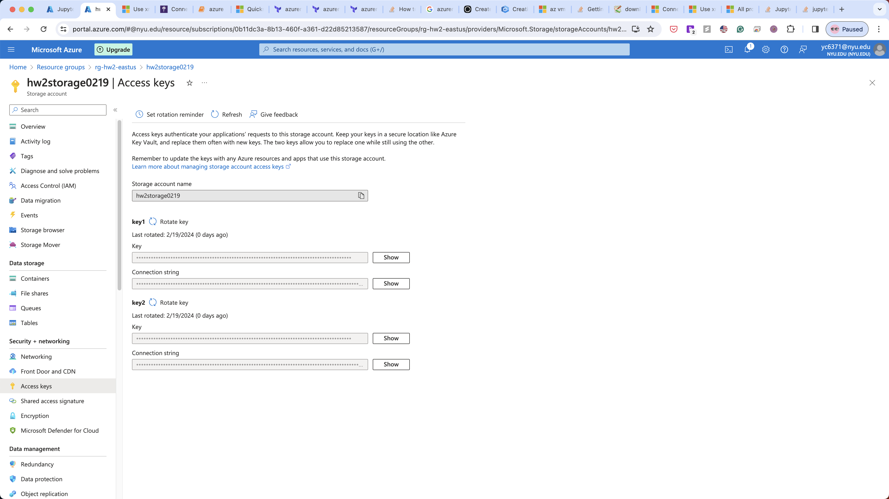
- [x] Run the jupyter notebook
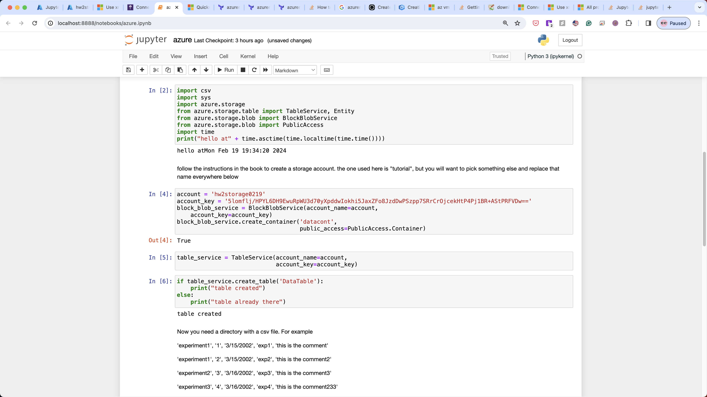
- [x] Upload the files to the storage account
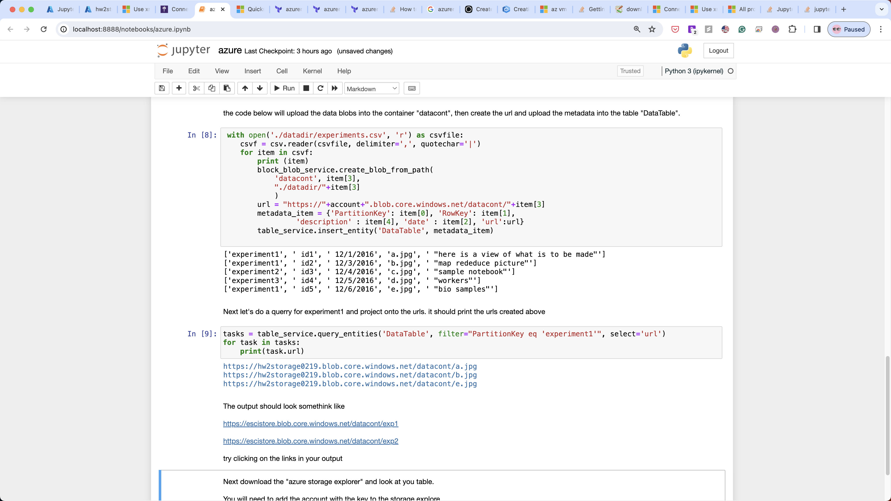

## AWS

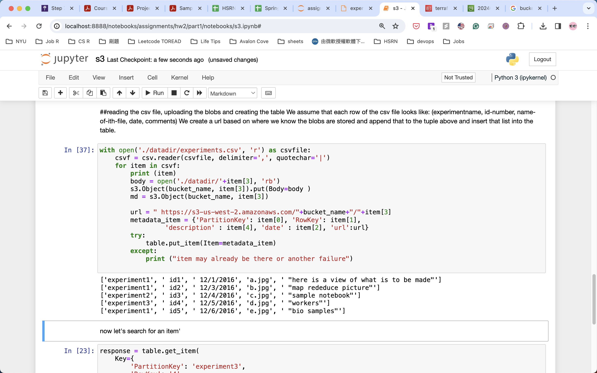

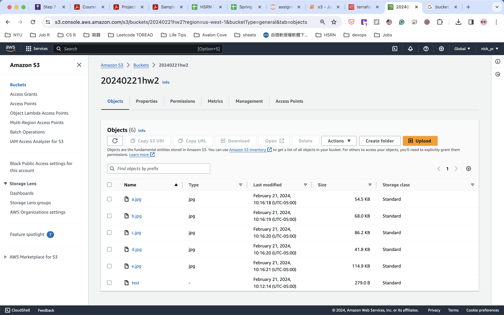

## GCP
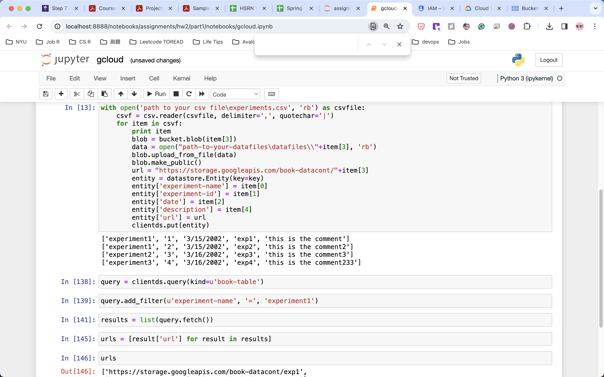

# Part 2 Commission an Azure Linux Data Science (DS) VM

- [x] Create your own passphrase protected private and public key
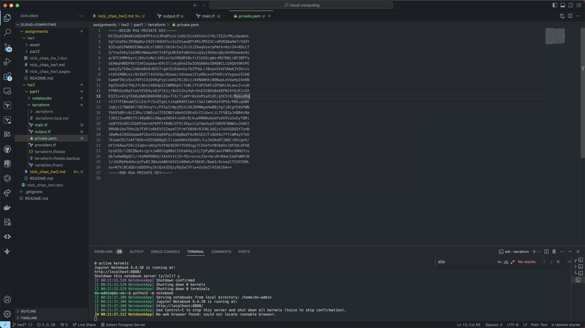

- [x] Install and deploy a Linux DS VM using your public key.
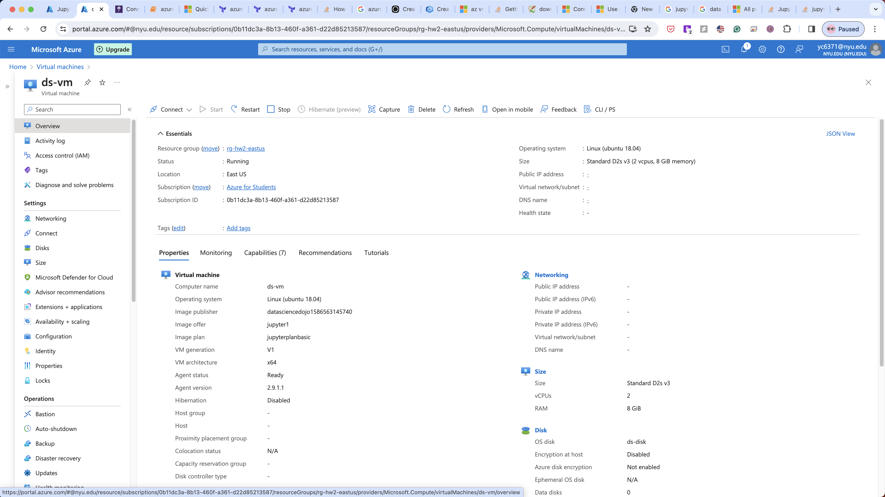
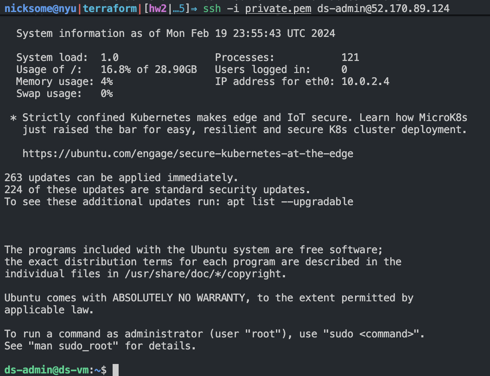

- [x] Extra Credit: Setup RDP to access the Linux VM.
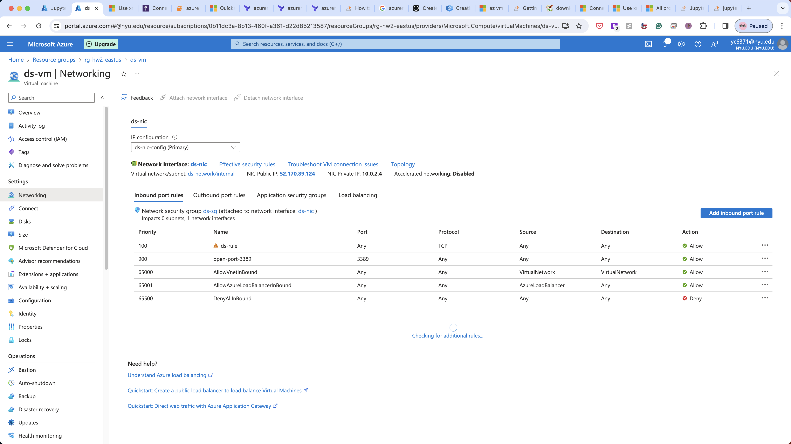
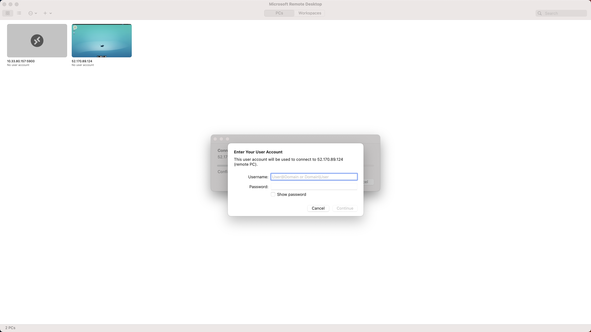
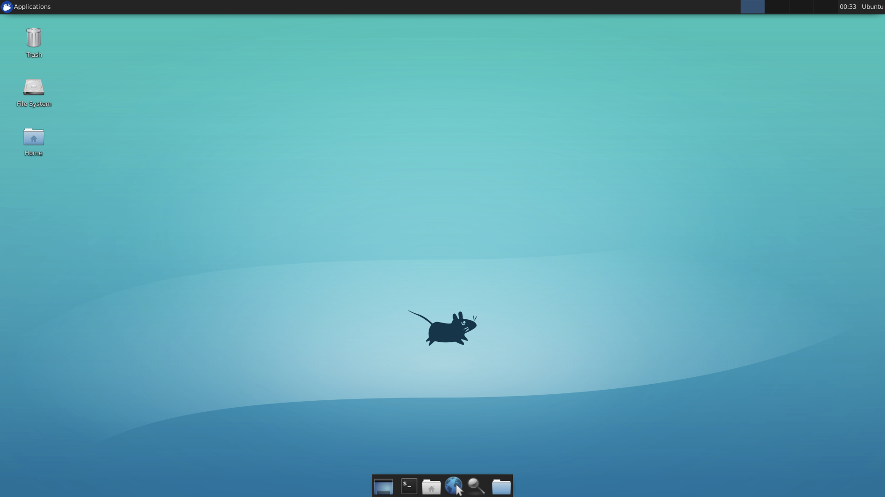

- [x] Run a Jupyter notebook on the VM through a Jupyter instance and the VM Jupyter Hub
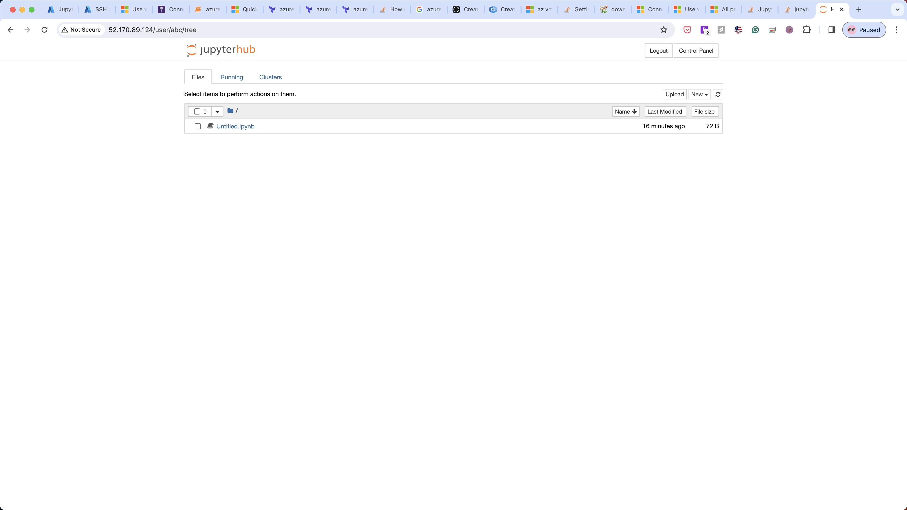
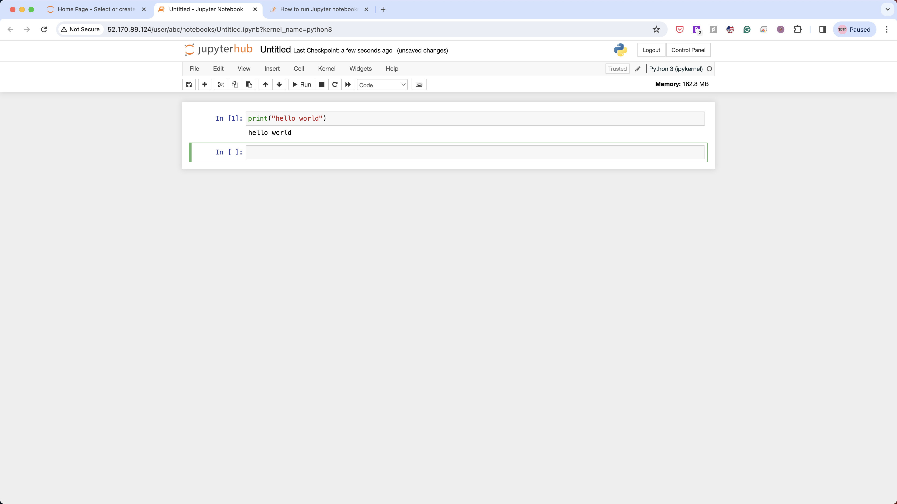