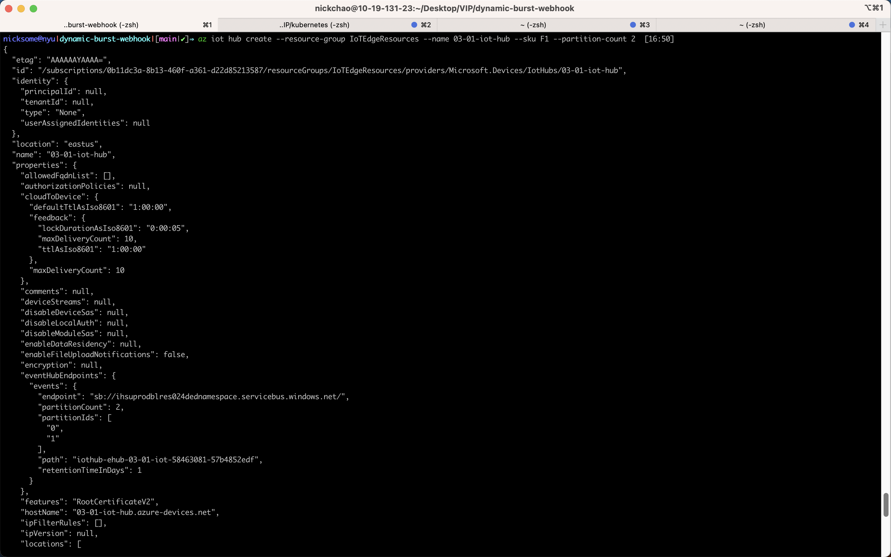
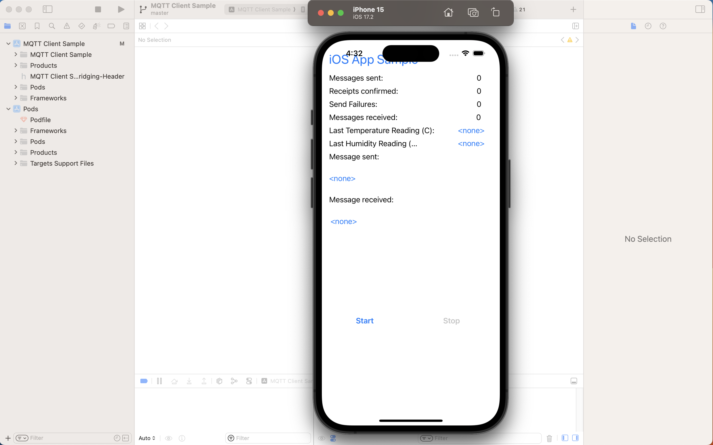

# Part 1: How to Enable Compute VNFs and 5G with Azure

Integration of Virtual Network Functions (VNFs) and 5G propels the development of fog and edge solutions. Compute VNFs optimize resource allocation for scalable and efficient deployments. Meanwhile, 5G integration offers high-speed, low-latency networks crucial for real-time data processing. Example could be smart grids. Deploying edge computing in smart grids enables real-time monitoring and control of power distribution. Edge devices analyze data locally, ensuring rapid response to fluctuations and optimizing grid performance.

# Part 2: Deploy an IoT Edge Module using Microsoft Azure IoT capabilities

- [x] Create resource group

- [x] Create iot hub

- [x] Create a device identity on iot hub

- [x] Create a Azure VM as iot device

- [x] Create a module on AWS iot hub and deploy to device

- [x] Check deployment on iot device

- [x] Delete resources

# Part 3: Turn a smart phone of your choice into an IoT device

- [x] Install Cocopods

- [x] Set up iot hub

- [x] Setup Xcode project and add connection string

- [x] Send/receive messages
