# Part I: Get familiar with Spark; execute and document the following exercises

## spark-euler 
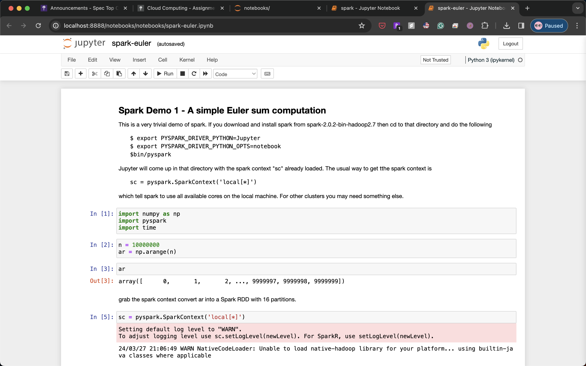

## spark
The system cannot take advantage of parallelism if the partition number is greater than that of cores.
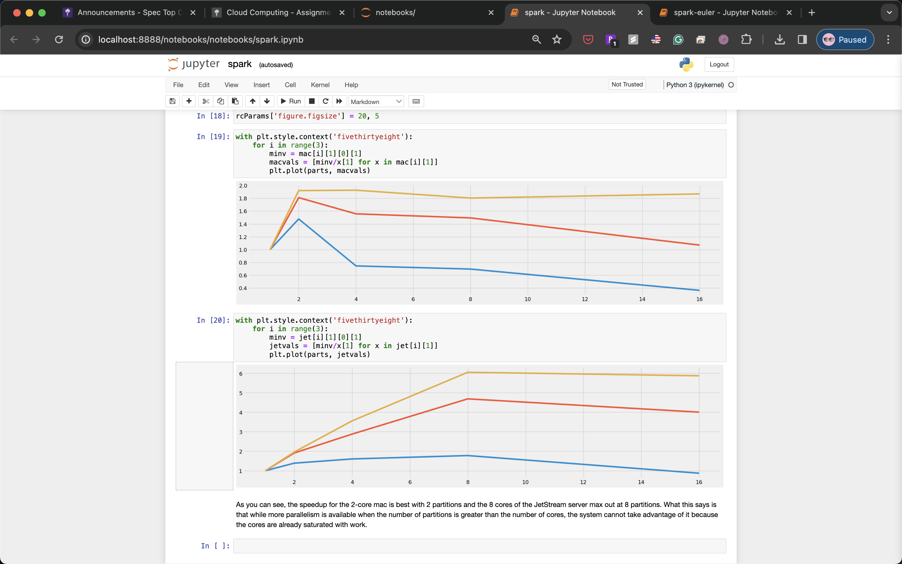

## sql-magic
Register decorators to run in-line sql commands
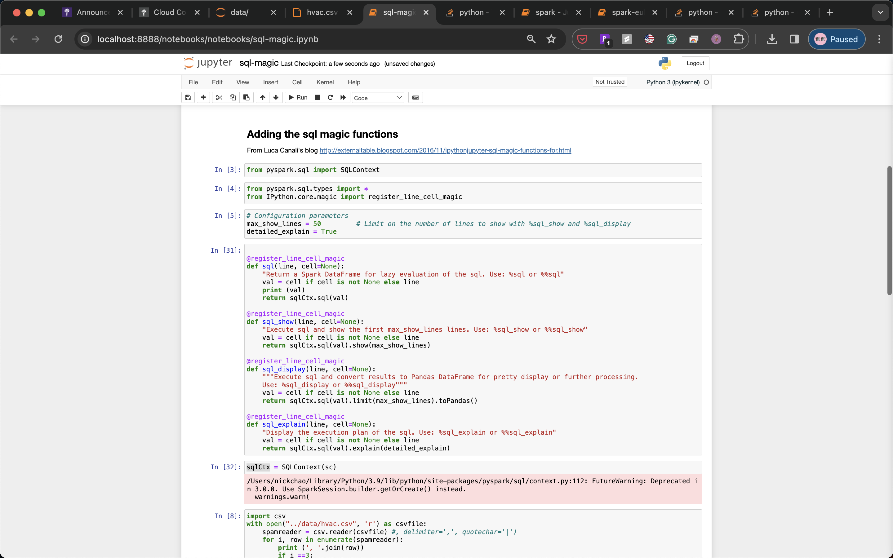
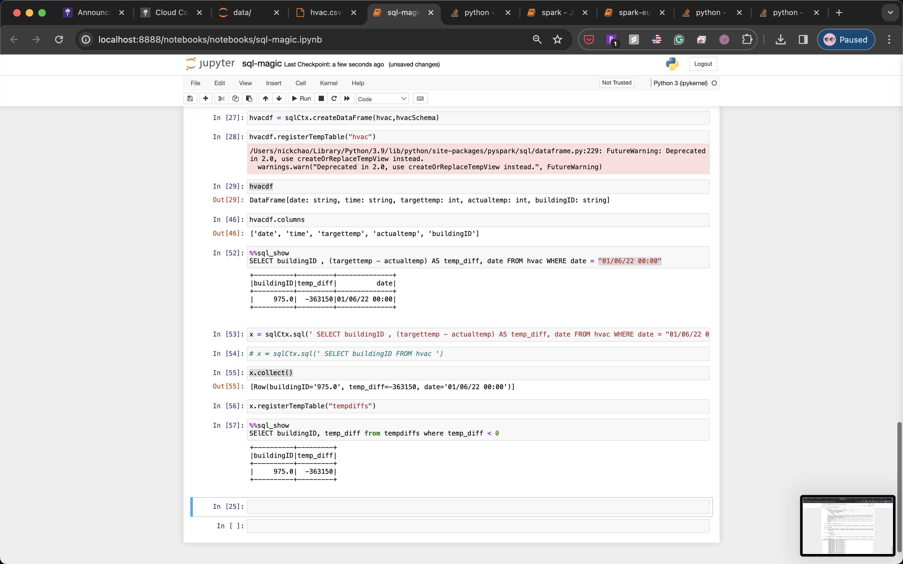

# Part II: Experiment with Spark on AWS

## aws-emr
Look for the number of page references that mention famous folks
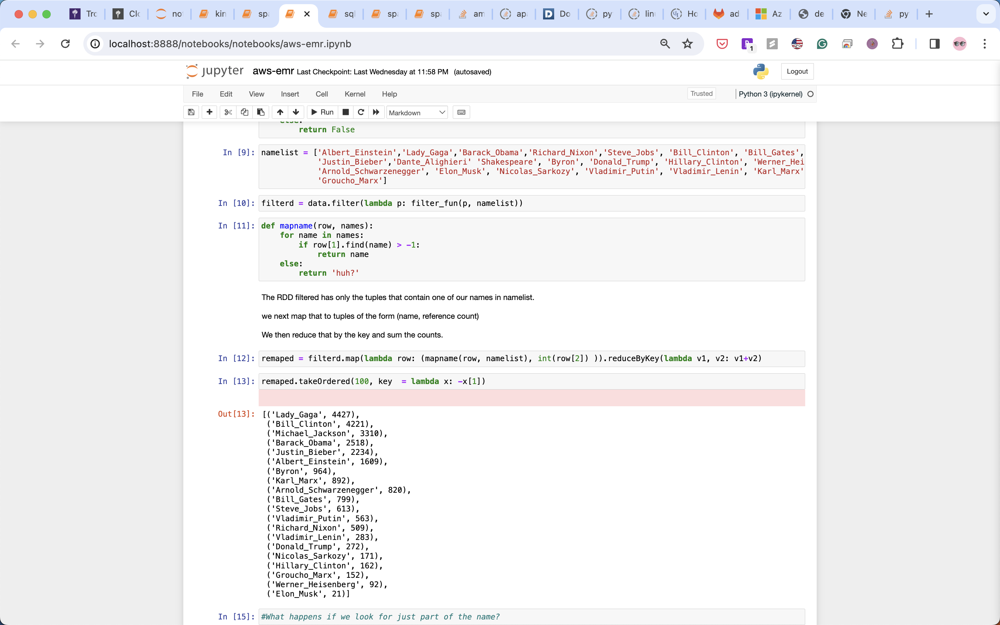
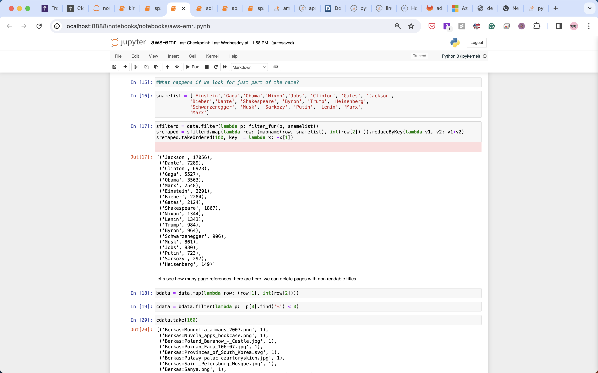

# Part III: Experiment with Google Datalab

(skip as the service is deprecated)

# Part IV: Experiment with Spark on Azure

## sparkml
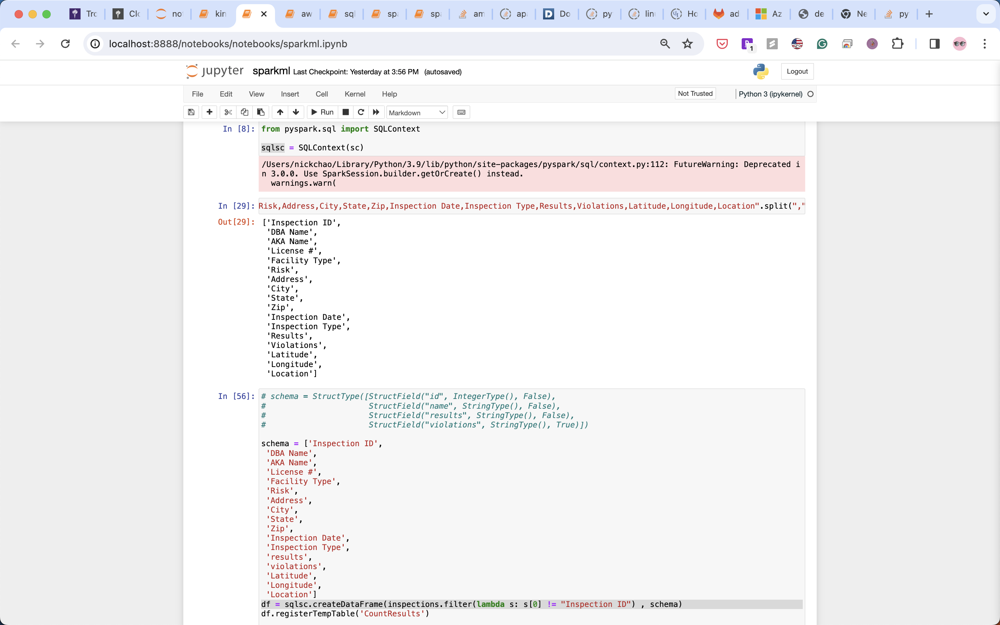

# Part V: Experiment with Streaming Big Data on AWS

## kinesis
python producer 
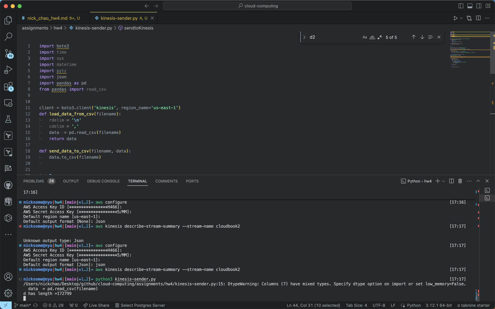

create kinesis data source
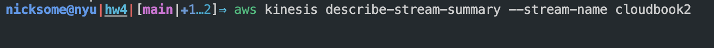

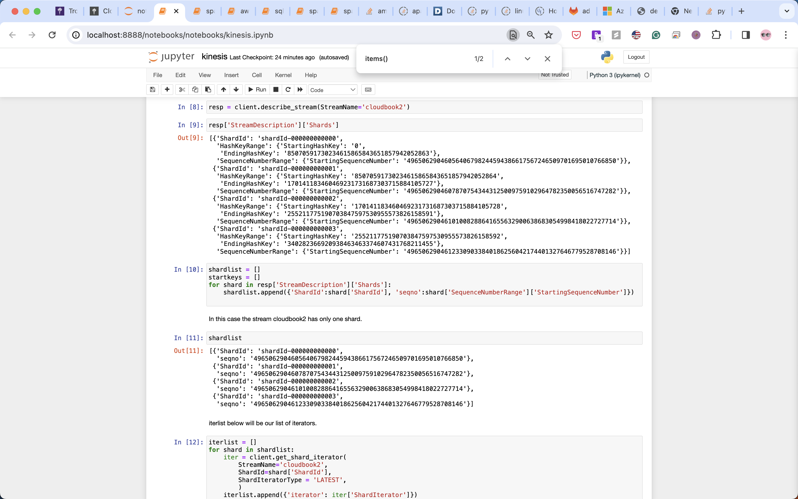
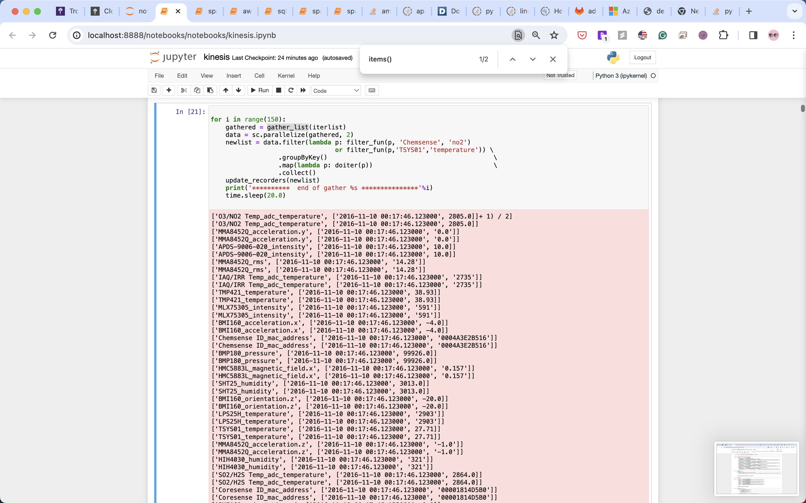
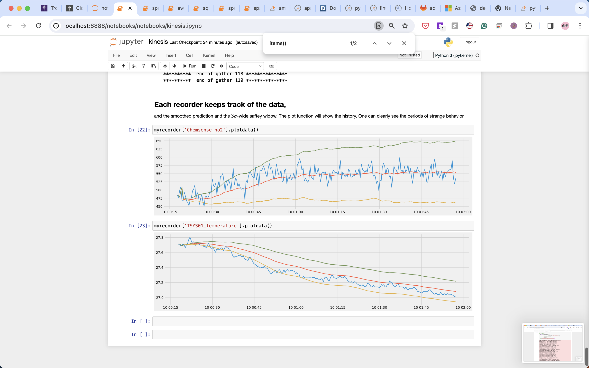
