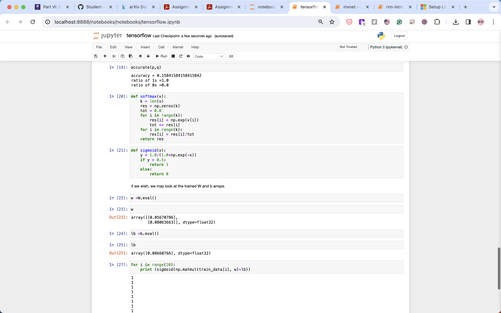

# Part I: Get familiar with Machine Learning using Spark; execute and document the following exercise

## sparkml


# Part II: Get familiar with Machine Learning using Azure ML; execute and document the following exercise

## azuremlc: skipped as models are no longer available

# Part III: Get familiar with Machine Learning using Amazon ML; execute and document the following exercise

# rnn-lstm


# Part IV: Experiment with Deep Learning using Amazon’s preferred Deep Learning toolkit MXNet; execute and document the following exercise

## mxnet: skipped as mxnet does not support M1 and is archieved


# Part V: Get familiar with Deep Learning using CNTK; execute and document the following exercise

## cntk: skipped as CNTK is no longer supported

# Part VI: Get familiar with Deep Learning using TensorFlow; execute and document

## tensorflow




# Part VII: Build additional experiments to be able to provide an illustration of Shallow and Deep Machine Learning as well as Generative AI on all four Big Clouds. The experiments covered in Parts I-VI above should count towards the complete set of experiments provided as part of your assignment solution for Amazon, Google, and Microsoft Big Clouds.

I am using docker image to dev but encountered several package installation errors. I was not able to proceed further without the packages being installed properly.
```
docker run --rm -it -v .:/home/  --network host  --entrypoint  /bin/bash python:3.6.2
```

