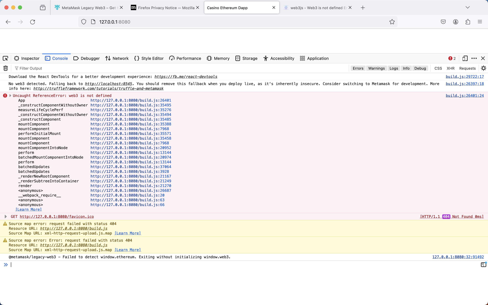

# Part I - Assignment 6-1: Follow the tutorial to create and deploy the Dapp in Ethereum (off- Cloud for now)

- deploy Smart Contracts on ropsten

- trasaction completed

- create the frontend of the Dapp
there were some issues with web3 library and the tutorial was not clear on how to fix it. I had to do some research and found out that the web3 library was not compatible with the latest version of the metamask.

# Part II - Assignment 6-2: Review the blockchain offerings and tutorials available on the various Big Clouds at GCP, AWS, and Oracle

- Google Cloud Platform
Google Cloud Platform offers a wide range of blockchain services. The main blockchain service offered by GCP is Google Cloud Blockchain. Google Cloud Blockchain is a fully managed blockchain service that allows you to create, deploy, and manage blockchain networks on Google Cloud Platform. Google Cloud Blockchain supports multiple blockchain platforms, including Ethereum, Hyperledger Fabric, and Corda. Google Cloud Blockchain provides a range of features, including secure key management, identity management, and monitoring and logging.

- Amazon Web Services
Amazon Web Services offers a range of blockchain services, including Amazon Managed Blockchain and Amazon Quantum Ledger Database (QLDB). Amazon Managed Blockchain is a fully managed blockchain service that allows you to create, deploy, and manage blockchain networks on AWS. Amazon Managed Blockchain supports multiple blockchain platforms, including Ethereum and Hyperledger Fabric. Amazon Managed Blockchain provides a range of features, including secure key management, identity management, and monitoring and logging. Amazon QLDB is a fully managed ledger database service that allows you to create, deploy, and manage ledger databases on AWS. Amazon QLDB provides a range of features, including secure key management, identity management, and monitoring and logging.

- Oracle Cloud
Oracle Cloud offers a range of blockchain services, including Oracle Blockchain Platform and Oracle Blockchain Applications. Oracle Blockchain Platform is a fully managed blockchain service that allows you to create, deploy, and manage blockchain networks on Oracle Cloud. Oracle Blockchain Platform supports multiple blockchain platforms, including Ethereum and Hyperledger Fabric. Oracle Blockchain Platform provides a range of features, including secure key management, identity management, and monitoring and logging. Oracle Blockchain Applications is a suite of blockchain applications that allows you to build and deploy blockchain applications on Oracle Cloud. Oracle Blockchain Applications provides a range of features, including secure key management, identity management, and monitoring and logging.

