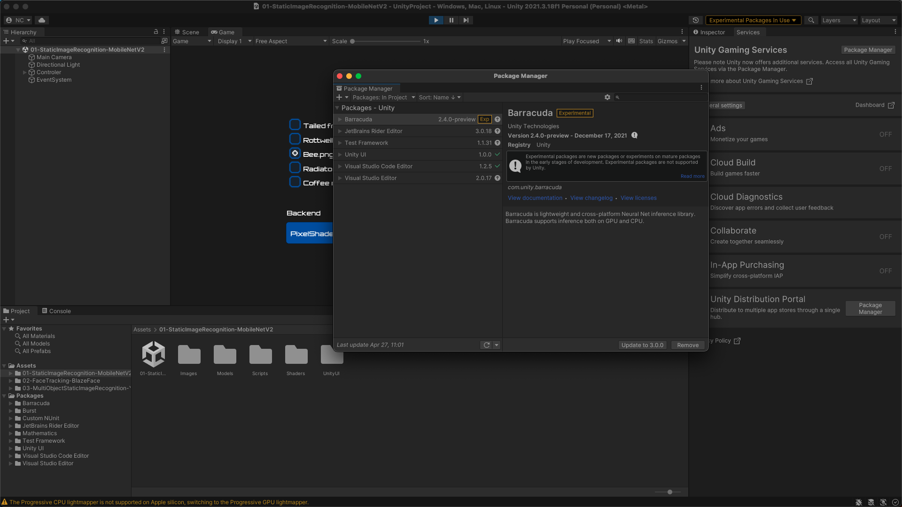

# Follow the instructions at the link below to install Barracuda

- [x] Install Barracuda in package manager

    

# Read the documentation the starter kit documentation

- [x] Run `barracuda-starter-kit`

    

# Get the BlazeFaceBarracuda project to run

- [x] Run the BlazeFaceBarracuda

    
